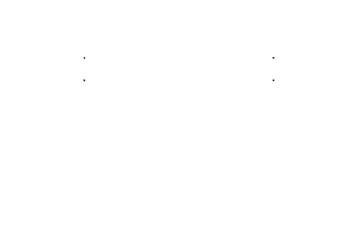
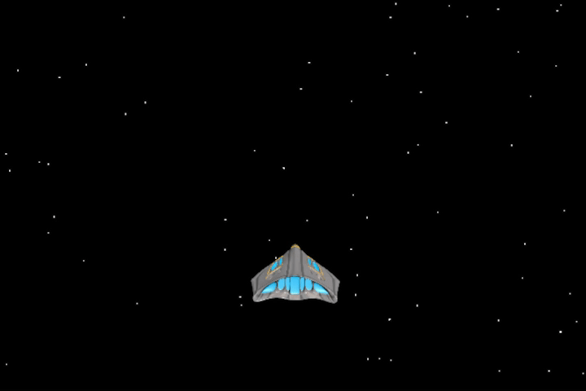

# Algorithmic Art

**Algorithmic art** (also known as algorithm art or computer-generated art) is a subset of generative art (art that in whole or in part has been created with the use of an autonomous system) which uses a scripted algorithm as a detailed recipe for the design and possibly execution of an artwork through computer code, functions, mathematical expressions and/or any other viable input.

This JavaScript exercise aims to pay homage to algorithmic art through a series of visually harmonic renders. To do so, the [p5.js](https://p5js.org/) library (which is built around creative coding) has been used.  
Note that there is an interactive side to this project:
* To switch between models, press the **1**, **2**, **3** and **4** keys (or, alternatively, the **A**, **S**, **D** and **F** keys).

* The **down arrow** and **up arrow** keys switch between the _default rendering mode_ and the _alternative rendering mode_ (respectively).  
Although these renders differ quite significantly in some cases (visually speaking), the underlying functions are the same.

* Users can speed up/down the animation of all renders using the mouse wheel.  
Note that the animation itself can be stopped and even move backwards (any changes are undone upon reloading).

The GIFs provided down below are just for illustration purposes - they butcher the animation quality and flow due to the compression and a 30fps cap.  
To see and interact with the script and its renders, there's a demo available at https://algorithmic-art.netlify.app/  
Otherwise, [download the repository](https://github.com/outerelocarlos/Algorithmic-Art/archive/refs/heads/main.zip) and try it out within a local server.

### Permissions

Camera permission is required so that **Model 4** can process the captured video feed.  
If this permission is not granted, a placeholder will be used instead.

### Shameless plug

[This other JavaScript exercise](https://github.com/outerelocarlos/Audio-Responsive-Algorithmic-Art) aims to pay homage to algorithmic art through a series of audio-responsive renders. Check it out if you liked this one.

 

## Model 1

The first model uses two sets of lines (red and blue) that are created by intersecting several points from a combination of sine and cosine functions.

The functions themselves define the path upon which the lines dance and, for a more artistically satisfying effect, the dominant line of each set has been programmed to have a higher opacity that the one that succeeds it. That trend is continued across all the lines specified in the code (20), with each trailing line being less opaque than its predecessor.

There is an interactivity layer exclusive to this model within the **left arrow** and **right arrow** keys.  
Those keys modify the sine and cosine functions that define the render, transforming the path upon which the lines dance.

 

 

The alternative rendering mode is built around the same functions but, instead of using the points that were previously intersected to create the lines as mere references, it draws them upon a white canvas creating a lotus-like drawing point by point.

 

 

## Model 2

The second model was built using a pair of maps divided in rectangular triangles. A randomly generated noise modifies the maps in their perpendicular axis from the top of the maps' surface to their bottom, mimicking a wave-like motion. This motion is reinforced by the contrasting color gradients placed upon each map, which creates various shapes when the maps overlap each other.

 

 

The alternative rendering mode of this model changes the arguments of the _beginShape()_ function, which in turn modifies how each tapestry is built. The maps themselves are unchanged, but the render looks visually distinct.

 

 

## Model 3

The third model is based upon the previous one, rotating the maps in a way that they mimic a terrain of sorts giving depth to the scene. The noise now organically creates a highland and the color gradients have been changed to enhance the depth of the scene (and to better complement each other).

A ship was added to emulate the look of a randomly generated space-themed videogame. To enhance its integration with the overall scene, a vibration was given to the ship to emulate the turbulence coming from the friction with the planet's air/atmosphere (this vibration is pseudo-random but dependent on the animation/travel speed).

Note that there is an interactivity layer exclusive to this model within the **left arrow** and **right arrow** keys.  
Those keys allow the ship to shift left and right (to further emulate the look of a videogame).  
The spaceship can also be hidden using the **H** key (use the same key to bring the ship back in the scene).

 

 

The alternative rendering mode changes the scenery from the randomly generated terrain to a Star Wars' based galaxy where the ship (which is unchanged albeit for the removal of the vibration, since there is no air in space) flies across the stars (which leave a trail dependent on animation/travel speed).

 

 

## Model 4

The forth and last model uses a looped ellipse generator to display the camera's feed with a raindrop-inspired effect. Camera permission has to be granted, otherwise a placeholder is be used instead (which is equally fine to appreciate the visual effect but loses the interactivity layer of the model).

The loop picks a point at random within the canvas and selects a color from that same point within the video feed. With the location and color picked, the ellipse is drawn and the loop restarts, drawing ellipse after ellipse and creating the aforementioned raindrop-inspired effect.

 

 

The alternative rendering mode changes the pacing and size of the raindrops/ellipses.  
Note how in both cases the right side (the video feed) is wider than the left side (the output): this is due to the script fitting the video feed to the canvas size (720 x 480).  
It is also worth noting that latency is expected if using the camera feed (since the image needs to be processed).
  
 

